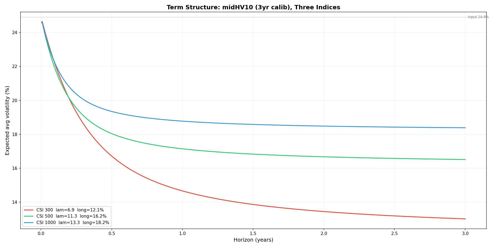

CIR波动率期限结构的构建
================================

1. 模型
------

CIR 对方差建模（SDE）：

.. math::

    dv_t = \lambda(\mu - v_t)dt + \sigma \sqrt{v_t} dW_t

三个参数从历史波动率数据校准（OLS 闭式解）：

- :math:`\lambda`：均值回归速度
- :math:`\mu`：方差长期中枢
- :math:`\sigma`：方差自身的波动率

校准公式见 :doc:`cir_model_ols_calibration` 公式 (8)-(11)。

2. 方差的期望路径（条件一阶矩）
--------------------------------

CIR 的条件期望（conditional expectation，即方差的一阶矩）有闭式解：

.. math::

    E[v_t \mid v_0] = \mu + (v_0 - \mu) \cdot e^{-\lambda t}

.. note::

    这是 :math:`E[v_t]`\ （方差过程的期望值），不同于 :math:`\text{Var}[v_t]`\ （方差过程自身的条件方差）。

    前者用于期限结构——关心方差往哪走；后者描述这个走向有多不确定。

    对比：

    .. list-table::
       :header-rows: 1

       * - 量
         - 含义
         - 公式
       * - :math:`E[v_t \mid v_0]`
         - 未来方差的期望水平
         - :math:`\mu + (v_0-\mu)e^{-\lambda t}`
       * - :math:`\text{Var}[v_t \mid v_0]`
         - 未来方差的离散程度
         - :math:`v_0\frac{\sigma^2}{\lambda}(e^{-\lambda t}-e^{-2\lambda t}) + \frac{\mu\sigma^2}{2\lambda}(1-e^{-\lambda t})^2`

这是从 :math:`v_0` 出发、以速率 :math:`\lambda` 指数衰减到 :math:`\mu` 的曲线。

3. 期限结构：路径平均方差
---------------------------

期限结构不应只看终端点 :math:`E[v_T]`，而应看整段路径 :math:`[0,T]` 上的平均：

.. math::

    V(T) = E\left[\frac{1}{T}\int_0^{T} v_t dt\right]

交换积分与期望（Fubini），并将条件期望 :math:`E[v_t]` 代入：

.. math::

    \begin{aligned}
    V(T) &= \frac{1}{T}\int_0^{T} E[v_t] dt \\
    &= \frac{1}{T}\int_0^{T} \left[\mu + (v_0 - \mu)e^{-\lambda t}\right] dt \\
    &= \mu + (v_0 - \mu) \cdot \frac{1 - e^{-\lambda T}}{\lambda T}
    \end{aligned}

记衰减因子：

.. math::

    D(T) = \frac{1 - e^{-\lambda T}}{\lambda T}

则：

.. math::

    \boxed{V(T) = \mu + (v_0 - \mu) \cdot D(T)}

:math:`D(T)` 的含义：初始偏离 :math:`(v_0 - \mu)` 在 0 到 :math:`T` 这段路径上的平均残留比例。

极限性质：

.. math::

    T \to 0:\; D(T) \to 1,\quad V(T) \to v_0 \qquad \text{（短期完全看当前）}

    T \to \infty:\; D(T) \to 0,\quad V(T) \to \mu \qquad \text{（远期只看长期中枢）}

4. 波动率期限结构
------------------

对 :math:`V(T)` 取平方根：

.. math::

    \boxed{\sigma(T) = \sqrt{V(T)} = \sqrt{\mu + (v_0 - \mu) \cdot \frac{1 - e^{-\lambda T}}{\lambda T}}}

5. 数据
-------

数据来源与预处理：

.. list-table::
   :header-rows: 1

   * - 标的
     - 数据表
     - 使用列
   * - 中证1000（000852）
     - ``000852_vol``
     - ``HV5``-``HV120``, ``midHV5``-``midHV120``
   * - 中证500（000905）
     - ``000905_vol``
     - 同上
   * - 沪深300（000300）
     - ``000300_vol``
     - 同上

- ``HVn``：n 日滚动历史波动率，年化
- ``midHVn``：n 日滚动中位数历史波动率，年化
- 年化交易日：242 天，:math:`\Delta t = 1/242`
- 校准方式：CIR OLS 闭式解（见 :doc:`cir_model_ols_calibration`）
- 入参：波动率平方（方差）

**校准窗口选择**

以中证1000为例，首先对比三组滚动窗口（HV5/HV10/HV20）与对应的三组中位数窗口（midHV5/midHV10/midHV20）。取近五年（2021-2026，1211个交易日）校准，统一以当前 HV10 值作为 :math:`v_0` 入参，各自的 :math:`\lambda` 和 :math:`\mu` 计算三年期波动率期限结构。

结果：HV 族长期中枢全部在 24% 附近，远高于近五年实际波动率均值 17%，高估了波动率的绝对水平；midHV 族中枢 15%\ :math:`\sim`\ 19%，更贴合实际水平。因此选择 midHV 族。

进一步对比 midHV 族在 3 年（2023-2026，725个交易日）与 5 年校准窗口下的差异。3 年窗口的长期中枢一致高于 5 年窗口 1\ :math:`\sim`\ 2 个百分点，更贴近当前市场结构，:math:`\lambda` 基本持平。因此选择 3 年校准窗口。

6. 三大指数期限结构
---------------------

统一以中证1000的当前 HV10 值作为 :math:`v_0` 入参，分别用三大指数各自的 midHV10 序列（2023-2026）校准出三套 :math:`(\lambda, \mu)`，计算各自的三年期波动率期限结构。

.. list-table::
   :header-rows: 1

   * - 标的
     - :math:`\lambda`
     - 长期中枢
   * - 沪深300（000300）
     - 6.9
     - 12.1%
   * - 中证500（000905）
     - 11.3
     - 16.2%
   * - 中证1000（000852）
     - 13.3
     - 18.2%

- 沪深300波动率中枢最低（12.1%），回归最慢（:math:`\lambda = 6.9`）——大盘股波动最温和
- 中证1000中枢最高（18.2%），回归最快（:math:`\lambda = 13.3`）——小盘股波动更剧烈但回归也更快
- 统一 :math:`v_0` 远高于三个模型各自的中枢，三条曲线全部向下收敛，衰减速度由各自的 :math:`\lambda` 决定
