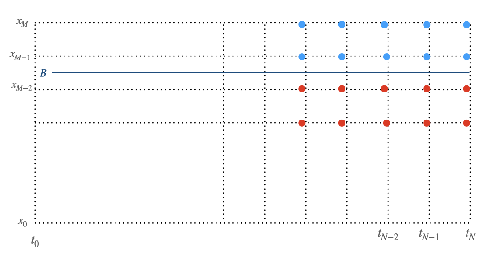

===========================
Finite Difference Method
===========================

The  partial differential equation for Black-Scholes-Merton model in log scale :Math:`x = \ln(S)`:

.. Math::
    :name: partial differential equation
    :label: bspde

    \frac{\partial f}{\partial t} + (r-q-\frac{\sigma^2}{2})\frac{\partial f}{\partial x} + \frac{1}{2}\sigma^2 \frac{\partial^2 f}{\partial x^2} = rf

Implicit scheme
------------------

The implicit finite difference equation for the partial differential equation is :

.. Math::
    :name: implicit finite difference equation
    :label: ifde

    \alpha f_{i, j-1} + \beta f_{i, j} + \gamma f_{i, j+1} = f_{i+1, j}

where 

.. Math::
    :label: ifde_coefficients

    \alpha &= \frac{\Delta t}{2\Delta x}(r - q - \sigma^2/2) - \frac{\Delta t}{2\Delta x^2}\sigma^2 \\
    \beta &= 1 + \frac{\Delta t}{\Delta x^2}\sigma^2 + r \Delta t \\
    \gamma &= - \frac{\Delta t}{2\Delta x}(r - q - \sigma^2/2) - \frac{\Delta t}{2\Delta x^2}\sigma^2 \\

or in the matrix multiplication form: 

.. Math::
    :name: implicit finite difference equation in matrix format
    :label: ifde_matrix

    \left ( \begin{matrix} 1 & 0 & 0 & ...& ...\\ 
                           \alpha & \beta & \gamma & 0 & ...\\ 
                           0 & \alpha & \beta & \gamma & ...\\
                           . & . & . & . &. \\
                           0 & ...&\alpha & \beta & \gamma \\
                           0 & ... & 0 & 0 & 1\\
            \end{matrix}
    \right)
    \left ( \begin{matrix} f_{i, 0}\\ 
                           f_{i, 1}\\ 
                          .\\
                          .\\
                           f_{i, M-1}\\
                          f_{i,M}\\
            \end{matrix}
    \right)
    =
    \left ( \begin{matrix} f_{i+1, 0}\\ 
                           f_{i+1, 1}\\ 
                          .\\
                          .\\
                           f_{i+1, M-1}\\
                          f_{i,M}\\
            \end{matrix}
    \right)

Explicit scheme
-----------------
And the explicit finite difference equation for the partial differential equation is 

.. Math::
    :label: efde

    \alpha^* f_{i+1, j-1} + \beta^* f_{i+1, j} + \gamma^* f_{i+1, j+1} = f_{i, j}

where 

.. Math::
    :label: efde_coefficients

    \alpha^* &= \frac{1}{1+r\Delta t}[-\frac{\Delta t}{2\Delta x}(r-q-\sigma^2/2)+\frac{\Delta t}{2\Delta x^2}\sigma^2] \\
    \beta^* &= \frac{1}{1+r\Delta t}(1-\frac{\Delta t}{\Delta x^2}\sigma^2)\\
    \gamma^* &= \frac{1}{1+r\Delta t}[\frac{\Delta t}{2\Delta x}(r-q-\sigma^2/2)+\frac{\Delta t}{2\Delta x^2}\sigma^2] \\

the explicit finite difference equation can be also written in the matrix format:

.. Math::
    :name: explicit finite difference equation in matrix format
    :label: efde_matrix

    \left ( \begin{matrix} 1 & 0 & 0 & ...& ...\\ 
                           \alpha^* & \beta^* & \gamma^* & 0 & ...\\ 
                           0 & \alpha^* & \beta^* & \gamma^* & ...\\
                           . & . & . & . &. \\
                           0 & ...&\alpha^* & \beta^* & \gamma^* \\
                           0 & ... & 0 & 0 & 1\\
            \end{matrix}
    \right)
    \left ( \begin{matrix} f_{i+1, 0}\\ 
                           f_{i+1, 1}\\ 
                          .\\
                          .\\
                           f_{i+1, M-1}\\
                          f_{i+1,M}\\
            \end{matrix}
    \right)
    =
    \left ( \begin{matrix} f_{i, 0}\\ 
                           f_{i, 1}\\ 
                          .\\
                          .\\
                           f_{i, M-1}\\
                          f_{i,M}\\
            \end{matrix}
    \right)

Crank-Nicolson scheme
----------------------

The Crank-Nicolson scheme is a mixture of the implicit scheme and the explicit scheme. 
For simplicity, we use :Math:`\textbf{A}` to denote the  matrix in :Math:numref:`ifde_matrix`,
:Math:`\textbf{B}` to denote the matrix in :Math:numref:`efde_matrix`, and the option values at time :Math:`t_i` as the column vector :Math:`\textbf{F}_i`.

Thus, equations :Math:numref:`ifde_matrix` and :Math:numref:`efde_matrix` can be written as:

.. Math::
    :label: ie_fde_matrix

    \textbf{A} \textbf{F}_i &= \textbf{F}_{i+1} \\
    \textbf{B} \textbf{F}_{i+1} & = \textbf{F}_i \\

By summing up the above two equations, the iterative algorithm for the Crank-Nicolson scheme is 

.. Math::
    :label: Crank-Nicolson

    \textbf{F}_i = (\textbf{A} + \text{I})^{-1}(\textbf{B} + \textbf{I}) \textbf{F}_{i+1}

by calculating the column vectors :Math:`\textbf{F}_i` backwardly with the inital values :Math:`\textbf{F}_N` and some proper boundaries,
the option's present values :Math:`\textbf{F}_0` could be worked out.

Algorithm demonstration
----------------------------------

  
